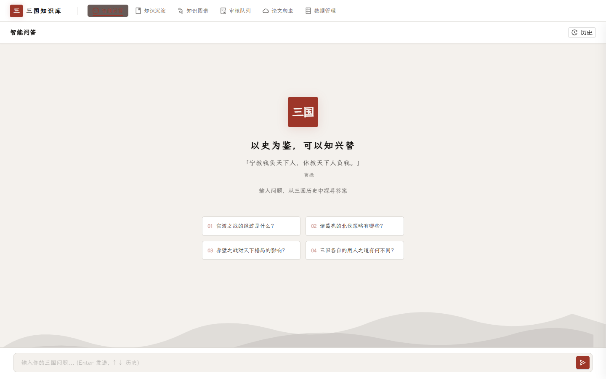
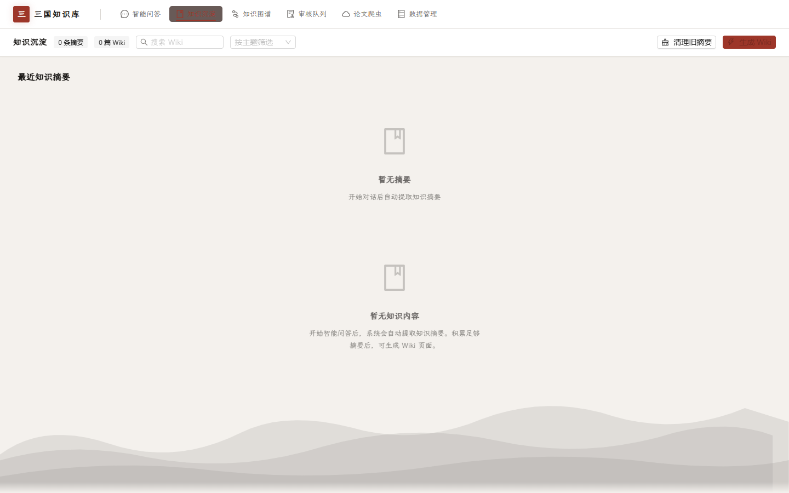
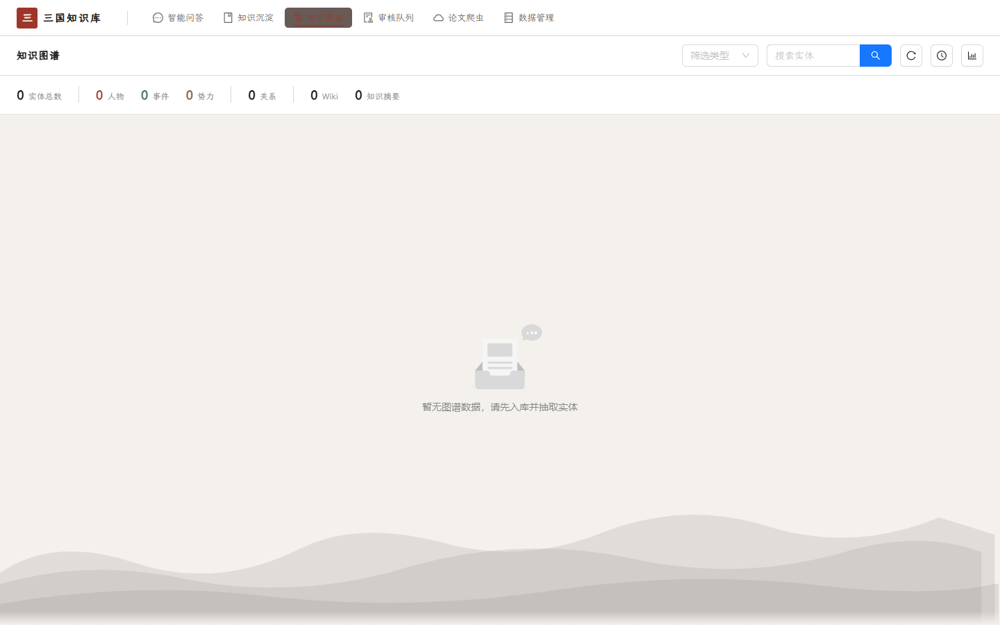
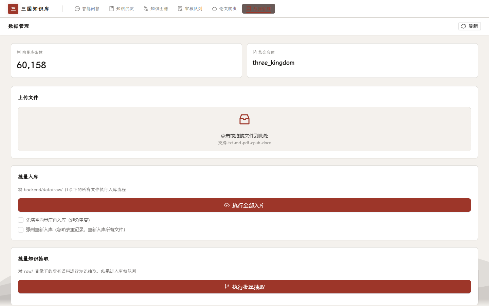

# 三国历史知识库

> 基于 Agentic RAG + 知识图谱的三国历史智能问答系统

专注于公元 184 年（黄巾之乱）至 280 年（西晋统一）的中国历史，提供严谨的学术级问答、知识沉淀与可视化。

---

## 功能展示

<table>
<tr>
<td align="center"><b>💬 智能问答</b></td>
<td align="center"><b>📚 知识沉淀</b></td>
</tr>
<tr>
<td></td>
<td></td>
</tr>
<tr>
<td align="center"><b>🕸️ 知识图谱</b></td>
<td align="center"><b>📊 数据管理</b></td>
</tr>
<tr>
<td></td>
<td></td>
</tr>
</table>

---

## 核心功能

### 智能问答（Agentic RAG）

基于 LangGraph 的六节点状态机，每次回答经过：路由 → 分解 → 检索 → 评分 → 生成 → 反思 → 定稿。

- **三层提示词系统**：身份定义 / 回答规范 / 任务级指令，分离关注点
- **信源分级**：正史（一级）→ 演义（二级）→ 野史（三级），回答严格标注来源
- **幻觉防护**：不编造内容，推断明确标注，拒绝模糊引用

### 知识沉淀

- **自动摘要**：每次问答后自动提取 3-5 句精华摘要，存入向量库
- **Wiki 生成**：用户触发 LLM 蒸馏，将多条摘要整合为结构化知识页面
- **卷轴式阅读**：IntersectionObserver 驱动的逐段入场动画，水墨风格排版

### 知识图谱

- SQLite 存储人物 / 事件 / 势力实体及关系
- G6 可力导向图可视化，支持搜索与详情查看

### 数据管理

- 文件上传入库（支持 .txt / .md / .pdf / .epub / .docx）
- 批量入库：扫描 `data/raw/` 目录，自动转换格式、切分、Embedding
- 实时进度：SSE 推送的水墨风格进度条

---

## 技术栈

| 层级 | 技术 |
|------|------|
| 后端 | FastAPI + LangChain + LangGraph |
| 前端 | React + Ant Design + Vite + TypeScript |
| 向量库 | ChromaDB |
| 关系库 | SQLite |
| Embedding | stella-mrl-large-zh-v3.5-1792d（本地 HuggingFace，1792d → 1024d MRL 降维） |
| LLM | 通过 OpenAI 兼容 API 调用 |

---

## 项目结构

```
three_kingdom/
├── backend/
│   ├── app/
│   │   ├── api/router.py       # API 路由
│   │   ├── core/               # 配置、数据库、进度追踪
│   │   ├── kg/                 # 知识图谱：抽取、审核、入库
│   │   ├── rag/                # RAG：Agent、向量库、记忆、Wiki
│   │   ├── prompts/            # 三层提示词（identity.md / rules.md）
│   │   └── models/             # 数据模型
│   ├── data/
│   │   ├── raw/                # 原始文献（放入此处自动识别）
│   │   ├── chroma/             # ChromaDB 持久化
│   │   └── sqlite.db           # 知识图谱 + 对话记录
│   └── scripts/                # 独立脚本
├── frontend/
│   └── src/
│       ├── pages/              # ChatPage / WikiPage / GraphPage / DataPage
│       ├── components/         # InkProgress 等组件
│       └── index.css           # 水墨史诗主题
├── pyproject.toml              # Python 依赖（uv 管理）
└── CLAUDE.md                   # 项目规范
```

---

## 快速开始

### 环境要求

- Python 3.13
- Node.js 18+
- CUDA 显卡（推荐，CPU 亦可）

### 安装

```bash
# 克隆项目
git clone <repo-url>
cd three_kingdom

# Python 依赖（严格使用 uv）
uv pip install -r pyproject.toml

# 前端依赖
cd frontend
npm install
```

### 配置

创建 `backend/.env`：

```env
# LLM（OpenAI 兼容 API）
LLM_API_KEY=your-api-key
LLM_BASE_URL=https://api.openai.com/v1
LLM_MODEL=gpt-4o

# Embedding（可选，默认自动检测设备）
EMBEDDING_DEVICE=cuda
```

### 准备数据

将文献资料放入 `backend/data/raw/` 目录：

```
backend/data/raw/
├── 三国志.epub
├── 三国演义.txt
├── 后汉书.pdf
└── ...
```

支持格式：`.txt` / `.md` / `.pdf` / `.epub` / `.docx` / `.html` / `.rtf` / `.odt`

### 启动

```bash
# 后端
cd backend
uv run uvicorn app.main:app --reload --port 8000

# 前端
cd frontend
npm run dev
```

访问 `http://localhost:5174`

### 入库

在「数据管理」页面点击「执行全部入库」，或手动运行：

```bash
cd backend
python scripts/ingest_qinhan.py
```

---

## 信源分级体系

| 等级 | 来源 | 引用方式 |
|------|------|---------|
| 一级 | 正史：《三国志》《后汉书》《晋书》 | "据《三国志·XX传》记载..." |
| 二级 | 演义：《三国演义》 | "在《三国演义》中...（此为文学创作）" |
| 三级 | 野史：《世说新语》《裴注引文》 | "据野史记载...（可信度存疑）" |

---

## API 端点

| 方法 | 路径 | 说明 |
|------|------|------|
| POST | `/api/chat` | 智能问答 |
| POST | `/api/chat/stream` | 流式问答（SSE） |
| GET | `/api/sessions` | 会话列表 |
| GET | `/api/knowledge` | 知识摘要 |
| GET | `/api/wiki` | Wiki 页面列表 |
| POST | `/api/wiki/distill` | 生成 Wiki |
| POST | `/api/ingest` | 触发入库 |
| GET | `/api/ingest/progress/{id}` | 入库进度（SSE） |
| GET | `/api/graph` | 知识图谱数据 |
| GET | `/api/stats` | 向量库统计 |

---

## 设计风格

**水墨史诗** —— 宣纸淡墨 + 电影质感

- 胶片颗粒（SVG noise）
- 暗角晕影（径向渐变）
- 漂浮粒子（CSS 动画）
- 水墨山峦视差（SVG 三层）
- LXGW WenKai（霞鹜文楷）字体
- 朱砂 `#b94432` / 青石 `#5c7a6e` / 墨黑 `#1a1a1a`

---

## 开发规范

- **包管理**：严格使用 `uv`，禁止全局 pip
- **信源标注**：回答必须标注来源等级
- **提示词**：修改 `backend/app/prompts/*.md`，不改代码
- **进度条**：使用 `InkProgress` 组件，保持水墨风格统一

---

## License

MIT
